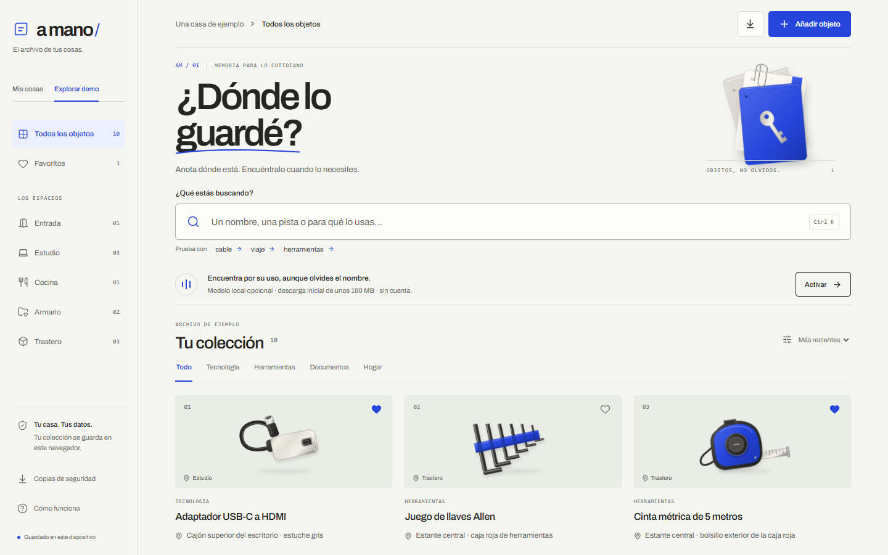

# A mano

**Remember the place. Find the thing.** A small, private household inventory that can find an object by what it is used for, even when its name is forgotten.

[Open A mano](https://eazyhood.github.io/a-mano/)



The interface is in Spanish. Try the fictional collection, search `estuche gris`, or activate the optional local model and ask `quiero mostrar la pantalla del computador en el televisor`. The adapter's card leads to the exact location originally written in the record. A mano does not track objects or generate their locations.

## Run

```sh
npm ci
npm run dev
```

Requires Node 20.19+ or 22.12+; built and tested with Node 24.16. `npm run build` creates a static website in `dist/`. `npm run preview` serves that build. No server account, inference key, database subscription or paid API is required.

## A complete small workflow

1. **Explorar demo** opens ten clearly fictional objects. Changes to this collection last only for the session.
2. **Mis cosas** starts a separate personal collection. Add an object, its room, its exact location, and a useful description. Save, edit, favorite, filter and delete records.
3. Search names, descriptions, tags or locations immediately with literal search. **Activar** explicitly enables the open model for additional semantic suggestions. Literal matches remain available and take priority.
4. Open the result and check the recorded place. Update the record when the object is moved.
5. **Copias de seguridad** exports a versioned JSON file. Import validates the complete file and asks for confirmation before replacing the personal collection. Corrupt stored data is never silently replaced on startup.

Keyboard: Tab and Enter for controls, Ctrl/Cmd+K for search, Escape for dialogs. Reduced-motion preferences are respected. Room filters scroll horizontally on narrow screens.

The catalogue design uses self-hosted Archivo, warm neutral surfaces and an ultramarine accent. Original vector objects have material detail and restrained shadows. Card movement preserves spatial context when filtering; hover and dialog transitions support inspection. Animations are disabled when reduced motion is requested. Illustrations remain decorative, not photos of saved possessions.

## What the open AI actually does

Transformers.js **3.8.1** runs the quantized ONNX **paraphrase-multilingual-MiniLM-L12-v2** model in a browser Web Worker. It embeds stored names, descriptions and tags, and a search query; cosine similarity ranks existing records. The model cannot create or change records. Search results are suggestions, not verified physical locations or probabilities.

The conversion is pinned to revision `2c4055b12046f11709e9df2c122e59ffbdc2f900` of [Xenova's ONNX model](https://huggingface.co/Xenova/paraphrase-multilingual-MiniLM-L12-v2). [Upstream model](https://huggingface.co/sentence-transformers/paraphrase-multilingual-MiniLM-L12-v2), Apache 2.0. Models, tokenizer and runtime are public downloads; approximately **160 MB** before transport compression, on first activation. The UI stays usable while preparing them. Browser caching may avoid repeat downloads; browser storage policies still apply.

The actual inference happens on the device, with no paid or hosted inference API. Open weights make that workflow possible without forwarding household descriptions to a model service. The search works in an already-loaded offline session after model initialization; **offline page reload/install is not implemented or claimed**.

## Privacy and boundaries

- Personal records are in localStorage on this browser/origin, not synchronized and not encrypted. Browser data deletion can remove them. Export backups deliberately and keep them private.
- The site host sees ordinary page requests, and the model host sees asset download requests. No analytics, mail sending, account linking or user-text API is implemented.
- The synthetic browser test checks that a distinctive query/location marker is absent from network URLs and request bodies. This is a scoped test, not a universal privacy certification.
- Illustrations are original decorative SVG drawings, not photos or evidence of ownership. Demo objects and scenarios are fictional.
- Similarity can be wrong. In a small synthetic evaluation, the hybrid search recovered 9 of 11 target records, and abstained for two absent objects. It missed the Allen-key and sofa-measuring paraphrases. A second model and fragmented indexing did not improve the tradeoff, so they were not adopted. This is not a user study or a general accuracy claim. [Evaluation](docs/ai-evaluation.md).

## Validation

```sh
npm test
npm run build
# With the built preview server running:
AMANO_URL=http://127.0.0.1:4173 node scripts/browser-check.mjs
AMANO_URL=http://127.0.0.1:4173 node scripts/browser-model-check.mjs
AMANO_URL=http://127.0.0.1:4173 node scripts/design-check.mjs
```

On PowerShell, set `$env:AMANO_URL` instead of the inline assignment. The browser scripts use an isolated **headless Edge** context, never a personal browser profile. The model check uses an isolated cache under `.cache/`, excluded from git. It will download public model assets when necessary.

Tests cover data validation, import round trips, malformed/oversized/duplicate files, storage failures, Spanish normalization and preservation of literal results. Browser evidence covers add/edit/favorite/reload, export, cancel/delete, restore, responsive layouts and real ONNX WASM inference. Reports under `artifacts/` identify their execution environment and limitations. Read the newest successful report; exploratory and failed checks retain their timestamps.

## Provenance and event status

New project created **2 October 2026 UTC** after the DEV Weekend window opened. Jhona requested a new useful app after reviewing five earlier projects. Source code was written for this app, with OpenAI Codex assistance; previous apps were references for needs, not copied as new entries. [Origin record](docs/PROVENANCE.md).

**No DEV submission is claimed.** The event requires building for a real friend or family member. The reviewed material does not establish such a recipient; no relationship, testimonial or use experience has been invented. The product and synthetic tests can be reviewed independently while that eligibility fact remains unresolved.

MIT license for this repository. Third-party software and model licensing remain separate; see [notices](THIRD_PARTY_NOTICES.md).
